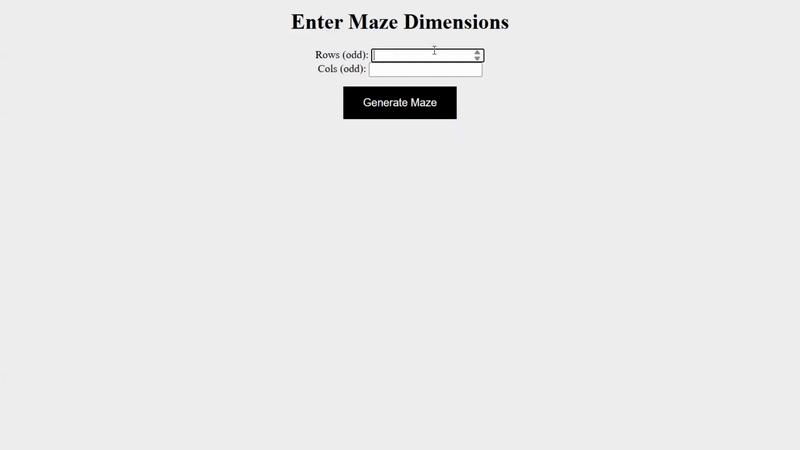

# Maze Game
This is a game that generates a random maze based on user input. The maze is generated using Prim's algorithm and allows the user to solve the maze using wasd keys.



## Instructions

- This is a single-player game where the player solves the maze
    - The goal is to move the player (@) from the starting position to the exit point (**E**)
- The game is held on the server using Crow
- The user should input an odd number greater than 1 for **each dimension** (width and height) of the maze

## Rationale of Choosing Prim

There are many other algorithms similar to Prim's, notably Kruskal's. This specific maze generator is using Prim's algorithm for a few significant reasons.
- Prim's grows a minimum spanning tree (MST) locally, expanding from the frontier. This results in a maze with a higher number of short branches/dead ends. This is the type of maze that we are used to.
- Kruskal's algorithm chooses an unvisited edge with the smallest weight **globally**. This often connects distant sections of the maze early, resulting in long, winding passages and fewer dead ends, which is less characteristic of the classic maze design.

## Tech Stack
* Core Language: C++ (or whatever the main language is)
* Server Framework: [Crow](https://crowcpp.org/)
* Front-End: Vanilla JavaScript, HTML, CSS

## Running the Program
First clone the repository and change directory to the cloned repository
```
$ git clone https://github.com/SooYeonAhn1/maze-game
$ cd maze-game
```

Enter the build directory
```
$ mkdir build # only needs to be done at initial build
$ cd build
```

Run the following commands
```
$ cmake ..
$ make
$ ./maze-game
```
